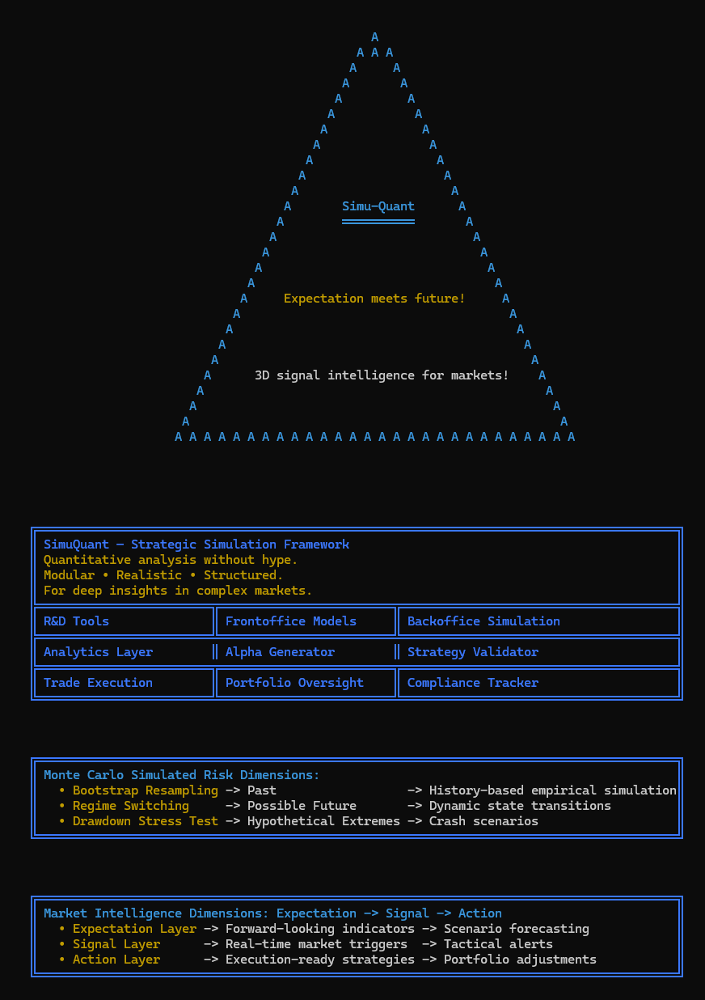
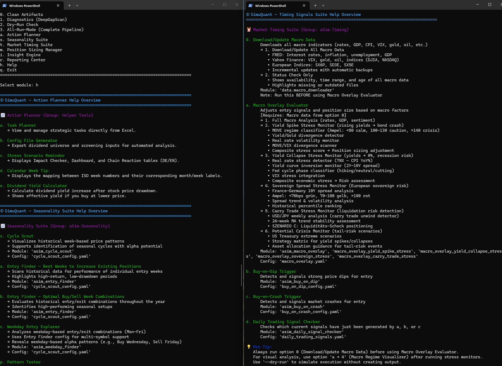
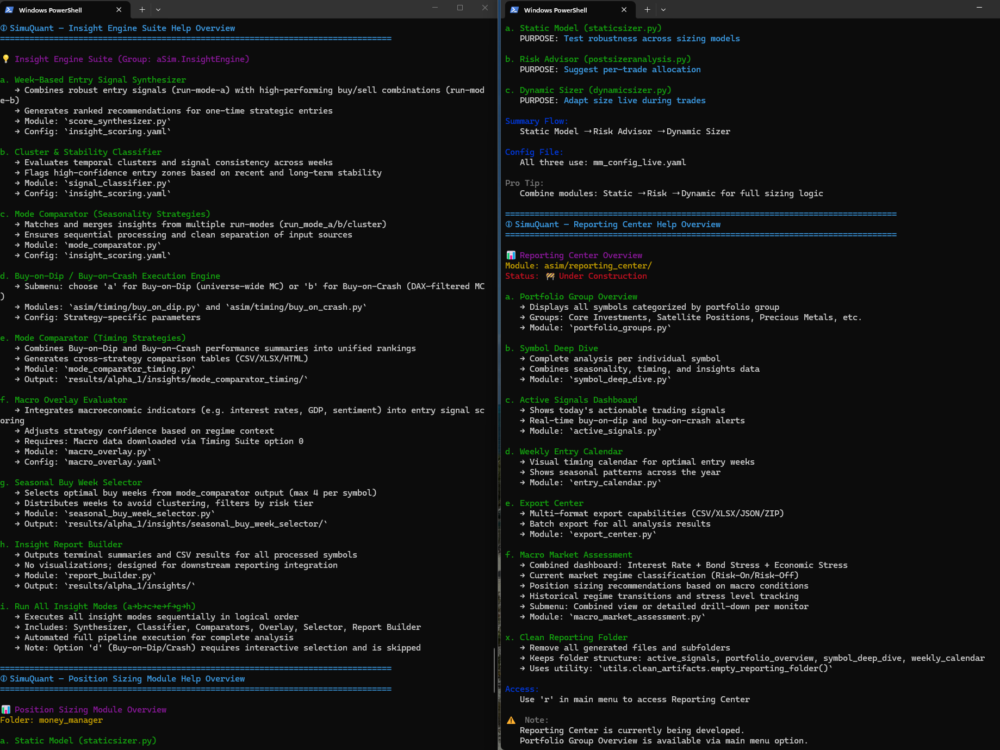
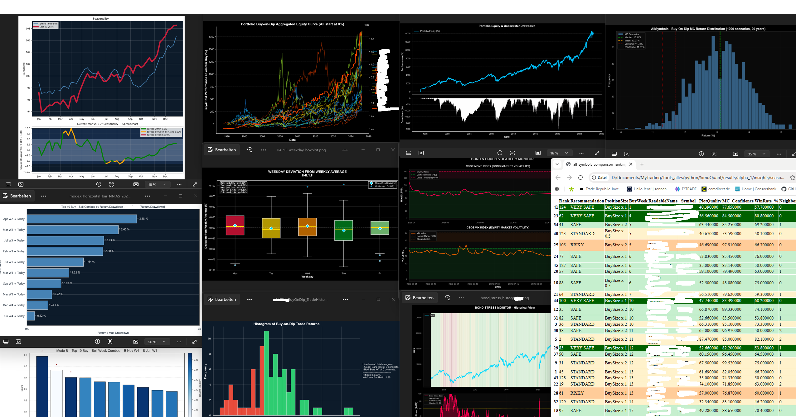
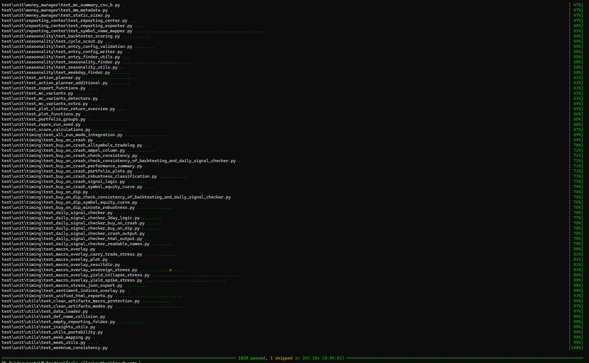
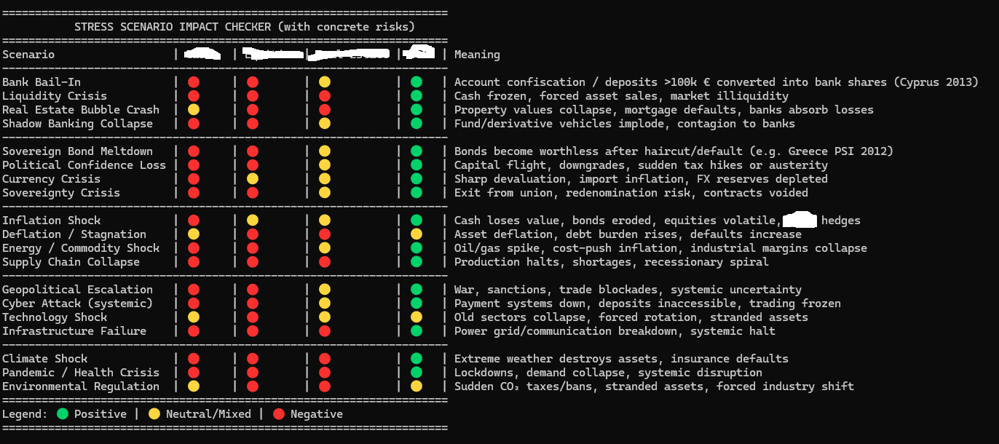

# SimuQuant Showroom

## Overview
A showcase repository for **SimuQuant**, a proprietary quantitative trading and simulation framework written in Python. While the core algorithmic engine remains private to protect institutional-grade proprietary strategies, this public workspace highlights the architecture, visualization standards, and analytical depth of the project. SimuQuant represents a comprehensive Monte Carlo simulation suite focused on multi-layered statistical validation for advanced equity and derivative strategies.



---

## Key Architecture & Pipeline
* **Automated Data Ingestion:** Daily cron-scheduled dispatchers pull, clean, and normalize end-of-day historical time-series data directly from Yahoo Finance (`data/quality/`).
* **Low-Layer Brute Force Engine:** High-performance computational layers process raw market data to execute exhaustive combinatorial searches across historical price matrices (`asim/layer2_advanced_simulation/`).
* **Mid-Layer Cluster Recognition:** Unsupervised machine learning models and clustering algorithms categorize market regimes, volatility states, and structural breaks (`asim/layer3_insight_engine/`).
* **High-Layer Monte Carlo Simulations:** The apex layer executes millions of path-dependent simulation iterations to stress-test specific trading hypotheses.

### Dispatcher & CLI Control



---

## Core Quantitative Modules
* **Seasonality Profiling:** Multi-factor temporal decomposition isolating recurring calendar anomalies, intraday-to-interday drift, and cyclical momentum shifts (`asim/seasonality/`).
* **Buy-on-Dip Optimization:** Stochastic modeling of drawdown thresholds, dynamic entry triggers, and recovery probability distributions across varied market regimes (`asim/timing/`).
* **Position Sizing Frameworks:** Comparative analytical implementations of Kelly Criterion, Optimal f, volatility-parity scaling, and dynamic risk-budgeting models (`asim/money_manager/`).



---

## Visualization Standards & Engineering Highlights
* **Bloomberg-Style Aesthetics:** Custom-styled matplotlib and seaborn visual outputs mimicking terminal-grade data density, featuring high-contrast dark backgrounds (`#0e1117` / terminal black), monospaced typography, and precise grid layouts tailored for professional risk presentation (`utils/insights/timing_mc_plots.py`).
* **Rigorous Testing Standards:** Full `pytest` integration covering over 1,000 unit and integration tests for end-to-end signal pipelines, data integrity checks, and regression tests (`test/`).



### Risk & Macro Monitoring


---

## Project Tree
```text
SimuQuant-Showroom/
├── asim/                    # Core multi-layered simulation & insight engines
│   ├── layer2_advanced_simulation/ # Brute-force parameter sweeps & MC variants
│   ├── layer3_insight_engine/      # Regime clustering & statistical analyzers
│   ├── money_manager/              # Position sizing (Dynamic/Static risk models)
│   ├── reporting_center/           # Bloomberg-style dashboards & HTML reporting
│   └── seasonality/                # Temporal decomposition & cycle scouts
├── config/                  # YAML-based environment & symbol configurations
├── data/                    # Automated ETL, cleaning, gap-scanning & diagnostics
├── products/                # Strategy deployment products (Alpha 1 & 2)
├── test/                    # Comprehensive unit & integration test suites (PyTest)
└── utils/                   # Shared utilities, grid search, & visualization engines
```

Disclaimer: The implementation details, optimization layers, vectorization methods, and proprietary position-sizing/Monte Carlo execution models contained in the private repository are strictly confidential. This showroom is intended solely for portfolio and recruitment evaluation.